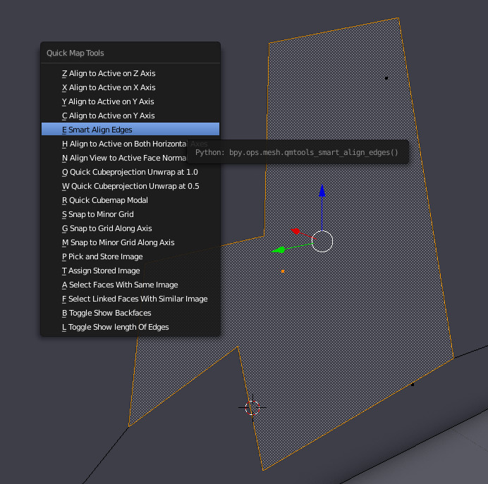

# Quick Map Tools

This is a plugin for the 3d modeling program [Blender](http://www.blender.org) that adds various 
geometry alignment, selection, and texturing tools and quick shortcuts to aid in making maps 
for videogames. I created it to speed up level design for a Unity project I'm working on, 
and it allows for much faster work on levels with are primarily boxy and axis aligned. This was 
primarily built as a personal tool but may be useful to others.

The Quick Map Tools menu is mapped to the Q key by default. The menu options are prefixed by a key label to ensure they are mapped by blender in a way that is conducive to fast modeling 
(at least with US or similar keyboards). For example, to quickly select linked faces that are
textured with the same image, you can just press Q and then F.

Most of the features in here don't do anything particularly complex, they usually just 
provide a fast way to do common things like aligning a group of vertices to another along an 
axis but with just a quick couple of hotkey instead of some unintuitive multi-step process 
that slows down work. Others just provide fast shortcuts to use built in Blender features
with particular settings.

This software is licensed under the GNU General Public License v3.0.

## Features

* _Align to active selection on X, Y, or Z axes_ -- Align all selected vertices to the last
selected vertex along the desired axis. There is also a hotkey for aligning on both horizontal axes.

* _Smart Align Edges_ -- Each of the selected edges will be aligned to the axis it 
most approximately lies on. The most useful of this is to clean up work from Blender's 
knife tool, for example, drawing out a rough, slanted doorway and then automatically 
aligning the edges to be perfectly horizontal and vertical.

* _Align View To Normal_ -- Faces the editing camera directly at the selected geometry, e.g. directly 
at a face. (Can be useful when used with Blender's knife tool, which lets you cut straight 
lines by pressing C, but only relative to the screen.)

* _Quick Cubemap and Quick Cubemap Half_ -- Tells Blender to UV unwrap the selected geometry using cube projection, at 1.0 and 0.5 scale respectively. There is also the Quick Cubemap Modal option which lets
you select from various common scales using the number keys.

* _Minor Grid Snapping, Grid Snapping Along Axis_ -- Improved grid snapping options allow you to snap
to the minor grid at any time (not just when in orthographic view) and to snap to either the major
or minor grid along just one axis.

* _Storing and Assigning Images_ -- Use Pick and Store Image to associate a texture with one of the 
number keys, and Assign Stored Image to apply the stored textures back to geometry quickly. Note that these work on images and not materials.

* _Selecting Geometry By Image_ -- Use Select Faces With Same Image to quickly select all the geometry
with a particular texture; useful for experimenting with changing out the set of textures used on
a level. You can also use Select Linked Faces With Same Image to quickly pick out parts of a level
that are textured differently such as pillars without selecting all the attached geometry. Again, these tools work on images and not materials.

* _Toggle Backfaces and Edge Length_ -- I found myself frequently changing these options so having a quick way to change these instead of going to the sidebar is useful.

## Screenshots

